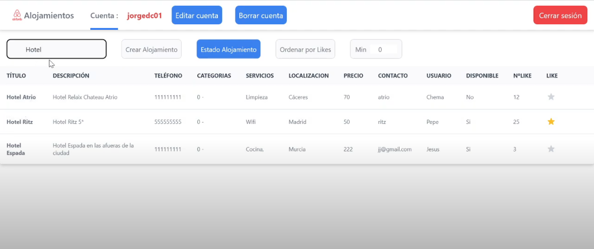

# Web Application Project - AngularJS & REST API

This repository contains the web application developed for the **Programming in Internet** course, utilizing **AngularJS** and a **REST API**. The application allows users to manage accommodations effectively and provides various functionalities as specified in the project requirements.

## Project Overview

The main objective of this project is to create a user-friendly web application for managing accommodations. Users can register, view, edit, and delete accommodation listings, as well as interact with other users through comments and favorites.

## Features

### Minimum Requirements

1. **User Registration**: 
   - Users can register with a username, email, and secure password.
   - Users can edit their profile information and delete their accounts.

2. **Accommodation Management**:
   - Users can create, view, edit, and delete accommodations, including fields such as:
     - Name (Text)
     - Description (Textarea)
     - Phone (Tel)
     - Contact Email (Email)
     - Price (Number)
     - Category (Dropdown)
     - Location (Text)
     - Services (Checkboxes)

3. **Favorites System**:
   - Users can mark accommodations as favorites, with a display of the number of favorites each accommodation has received.
   - Users can remove favorites they have previously marked.

4. **Search Functionality**:
   - Users can search for accommodations by title or description.

5. **Accommodation Status**:
   - Users can change the status of their accommodations between "available" and "reserved".
   - The application displays all, available, and reserved accommodations in separate sections.

### Additional Requirements

The following additional features have been implemented:

1. **Related Accommodations**:
   - When viewing an accommodation's details, related accommodations are presented based on category, location, price, or services.
   - Clicking on an accommodation title sends a request to the REST API with the accommodation ID.
   - The application fetches related accommodations by checking their location, price, and services against the selected accommodation.
   - Duplicate accommodations are removed from the list using a `Set` to ensure uniqueness.

2. **Social Media Panel**:
   - Each accommodation details page includes a social media panel displaying the accommodation's profile (e.g., tweets).
   - A new field `redSocial` (Social Media) has been added to the `Hosting` model and the corresponding database table.
   - The application allows users to specify their social media link when creating or editing an accommodation.

3. **High-Quality User Interface**:
   - The application features a responsive and visually appealing user interface, enhancing the overall user experience.

## Technologies Used

- **Frontend**: AngularJS, HTML, CSS
- **Backend**: REST API (Node.js, Express.js or similar)
- **Database**: NoSQL database (e.g., MongoDB)

## Airbnb App 's images

